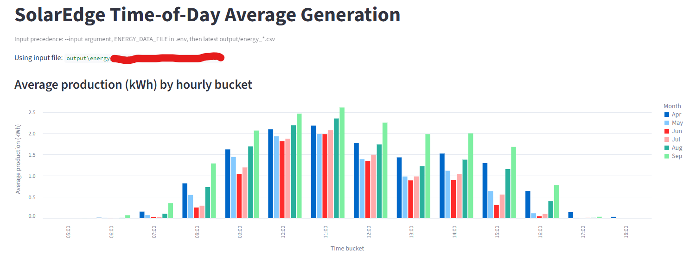

# SolarEdge Energy Fetcher

Small Python utility for logging in to SolarEdge Monitoring and downloading
energy data as CSV. It supports both 15-minute (quarter-hour) data and daily
aggregates, using Playwright for browser-based authentication.

## Objective

Provide a simple, scriptable way to export SolarEdge production and yield data
for a site over a date range, without manual UI exports.

## Requirements

- Python 3.11+
- `uv` (recommended) or a standard Python environment
- Network access to `monitoring.solaredge.com` and `login.solaredge.com`

## Install

```bash
uv sync
uv run playwright install
```

## Configuration (.env)

Create a `.env` file in the repo root:

```env
USERNAME=you@example.com
PASSWORD=your_password
SITE_ID=1234567
TIMEOUT_SECONDS=30
```

Required:

- `USERNAME`: SolarEdge account email
- `PASSWORD`: SolarEdge account password

Optional:

- `SITE_ID`: Default site ID if you omit `--site-id`
- `TIMEOUT_SECONDS`: Request/browser timeout in seconds (default `30`)

Never commit `.env` or any downloaded data to git.

## Usage

15-minute (quarter-hour) data:

```bash
uv run python src/fetch_energy.py --start-date 2026-03-01 --end-date 2026-03-03
```

Daily aggregates:

```bash
uv run python src/fetch_energy_daily.py --start-date 2026-03-01 --end-date 2026-03-31
```

For debugging, run with a visible browser window:

```bash
uv run python -u src/fetch_energy.py --start-date 2026-03-01 --end-date 2026-03-03 --headed
```

You can also provide an explicit output path:

```bash
uv run python src/fetch_energy.py --start-date 2026-03-01 --end-date 2026-03-03 --output output/my_export.csv
```

Disable chunk cache for a run:

```bash
uv run python src/fetch_energy.py --start-date 2026-03-01 --end-date 2026-03-03 --no-cache
```

Outputs default to `output/` and include `timestamp`, `production`, `yield`, and
`siteId` columns.

## Streamlit App (Time-of-Day Averages)

You can explore historical 15-minute data with a Streamlit UI that charts
average production by time-of-day in 15-minute or hourly buckets.



Supported aggregations:

- By month (Jan-Dec)
- By week of year (1-52)

Set input CSV path in `.env`:

```env
ENERGY_DATA_FILE=output/energy_1234567_2026-03-01_2026-03-31.csv
```

Run using `.env` input:

```bash
uv run streamlit run src/energy_streamlit.py
```

Or use the helper launcher script:

```bash
uv run python src/run_energy_app.py
```

Override input file from CLI:

```bash
uv run streamlit run src/energy_streamlit.py -- --input output/energy_931241_2019-01-01_2026-04-03.csv
```

Helper script with explicit input path:

```bash
uv run python src/run_energy_app.py --input output/energy_931241_2019-01-01_2026-04-03.csv
```

Input precedence is:

1. `--input`
2. `ENERGY_DATA_FILE` in `.env`
3. Latest matching file in `output/energy_*.csv`

## Streamlit App (Daily Average Generation)

You can also explore daily data with a Streamlit UI that charts average daily
generation as bar charts by month (12 bars) or calendar based week of year (52 bars).

Set daily input CSV path in `.env`:

```env
ENERGY_DAILY_DATA_FILE=output/energy_daily_1234567_2019-01-01_2026-03-30.csv
```

Run using `.env` input:

```bash
uv run streamlit run src/energy_daily_streamlit.py
```

Or use the helper launcher script:

```bash
uv run python src/run_energy_daily_app.py
```

Override input file from CLI:

```bash
uv run streamlit run src/energy_daily_streamlit.py -- --input output/energy_daily_931241_2019-01-01_2026-03-30.csv
```

Helper script with explicit input path:

```bash
uv run python src/run_energy_daily_app.py --input output/energy_daily_931241_2019-01-01_2026-03-30.csv
```

Daily app input precedence is:

1. `--input`
2. `ENERGY_DAILY_DATA_FILE` in `.env` (falls back to `ENERGY_DATA_FILE`)
3. Latest matching file in `output/energy_daily_*.csv`

## Notes

- Quarter-hour data is fetched one day at a time (the script enforces this).
- Daily data can be fetched in larger chunks (defaults to 31 days per request).
- Chunk responses are cached under `output/.cache/` and reused on later runs.
- Use `--no-cache` to bypass reading and writing chunk cache for a run.
- Failed chunk requests use exponential backoff and retry up to 3 attempts.

## Git Hygiene

This repo ignores `.env`, the `output/` directory, and `*.csv` files by default
to avoid committing credentials or personal energy data.
